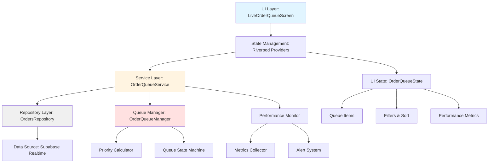
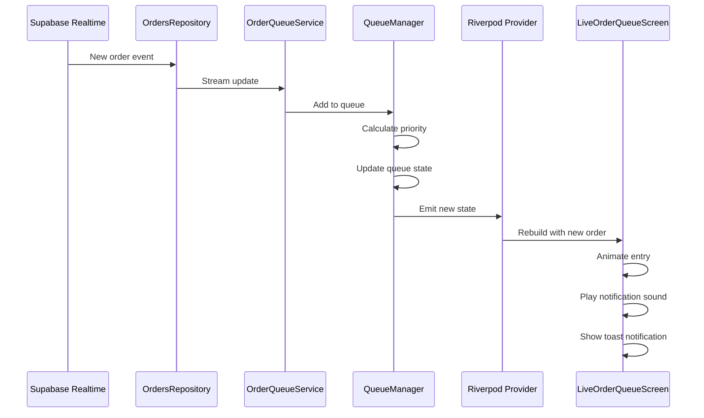
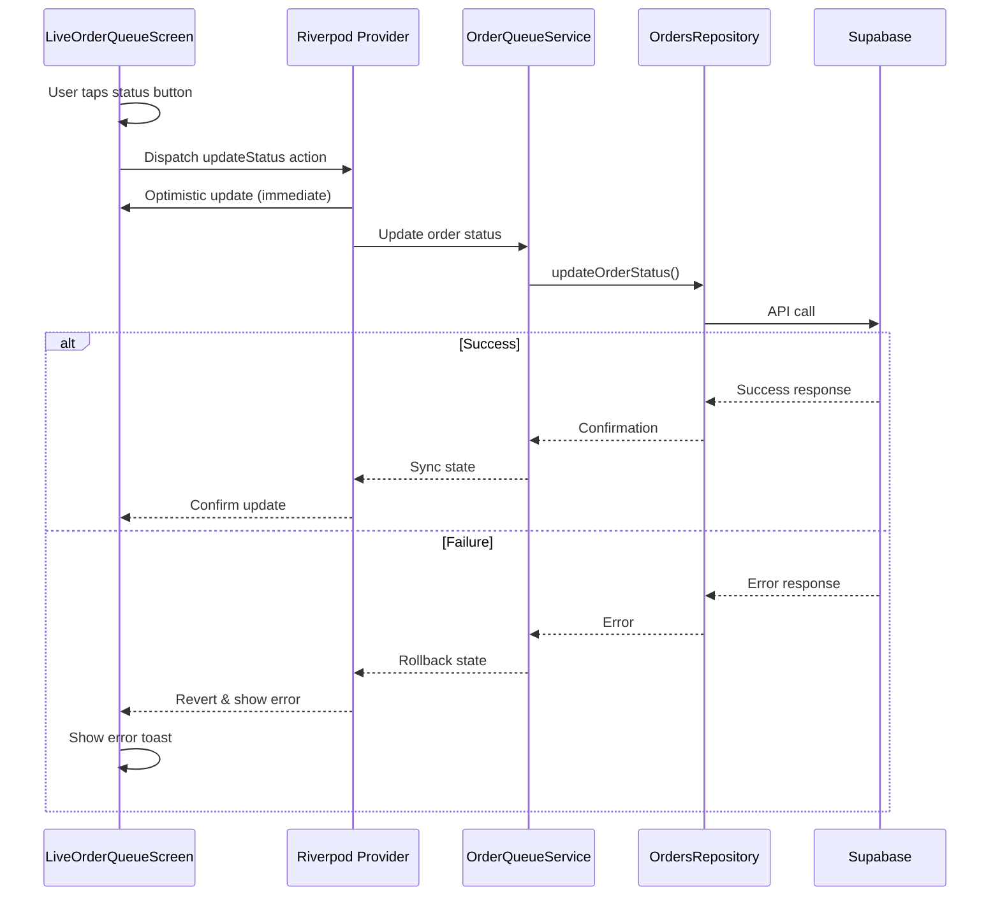
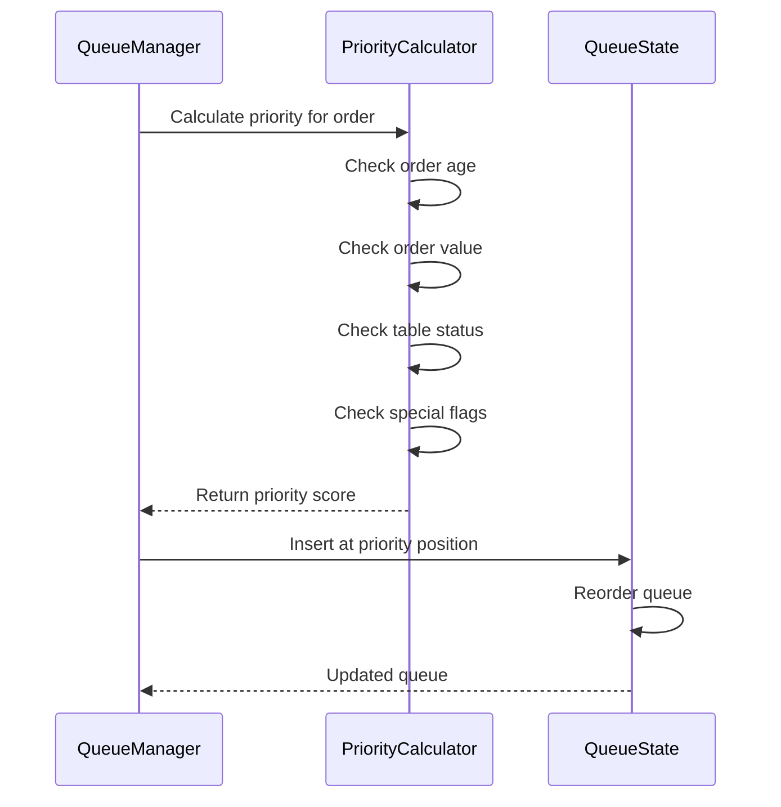

# Design Document: Live Order Queue Experience

## Overview

The Live Order Queue Experience is a real-time, scalable order management interface for the Orderlli admin application. This feature provides operators with an intuitive, high-performance dashboard to monitor, prioritize, and manage incoming orders in real-time. The system is designed to handle increasing order volumes while maintaining reliability and performance, addressing the medium architectural risk through proactive scalability strategies, optimistic UI updates, and robust error handling.

The design leverages Flutter's reactive capabilities with Riverpod state management, Supabase real-time subscriptions, and a queue-based architecture to ensure seamless order flow management. Key focus areas include visual feedback mechanisms, performance monitoring, graceful degradation, and operator efficiency.

## Architecture

The Live Order Queue follows a layered architecture with clear separation of concerns:



### Component Responsibilities

- **UI Layer**: Renders order queue, handles user interactions, displays visual feedback
- **State Management**: Manages reactive state, coordinates data flow, handles side effects
- **Service Layer**: Orchestrates business logic, queue management, performance monitoring
- **Repository Layer**: Abstracts data access, provides consistent interface to data sources
- **Data Source**: Supabase real-time subscriptions for live order updates

## Sequence Diagrams

### Real-Time Order Update Flow



### Order Status Update Flow



### Queue Prioritization Flow



## Components and Interfaces

### Component 1: LiveOrderQueueScreen

**Purpose**: Main UI component that renders the live order queue with real-time updates, filters, and operator controls.

**Interface**:
```dart
class LiveOrderQueueScreen extends ConsumerStatefulWidget {
  const LiveOrderQueueScreen({super.key});
  
  @override
  ConsumerState<LiveOrderQueueScreen> createState() => _LiveOrderQueueScreenState;
}

class _LiveOrderQueueScreenState extends ConsumerState<LiveOrderQueueScreen> {
  // UI state
  OrderQueueFilter _currentFilter = OrderQueueFilter.all;
  OrderQueueSort _currentSort = OrderQueueSort.priority;
  bool _showPerformanceMetrics = false;
  
  // Lifecycle methods
  @override
  void initState();
  @override
  void dispose();
  
  // Event handlers
  void _onFilterChanged(OrderQueueFilter filter);
  void _onSortChanged(OrderQueueSort sort);
  void _onOrderTapped(OrderDto order);
  void _onStatusUpdate(String orderId, OrderStatus newStatus);
  void _onRefresh();
  
  // UI builders
  Widget _buildQueueList(List<QueuedOrder> orders);
  Widget _buildOrderCard(QueuedOrder order);
  Widget _buildFilterBar();
  Widget _buildPerformancePanel();
  Widget _buildEmptyState();
  Widget _buildErrorState(String error);
}
```

**Responsibilities**:
- Render order queue with smooth animations
- Handle user interactions (tap, swipe, filter, sort)
- Display real-time updates with visual feedback
- Show performance metrics and alerts
- Manage local UI state (filters, sort, expanded cards)

### Component 2: OrderQueueService

**Purpose**: Core business logic service that manages the order queue, coordinates updates, and monitors performance.

**Interface**:
```dart
class OrderQueueService {
  final OrdersRepository _repository;
  final OrderQueueManager _queueManager;
  final PerformanceMonitor _performanceMonitor;
  
  OrderQueueService({
    required OrdersRepository repository,
    required OrderQueueManager queueManager,
    required PerformanceMonitor performanceMonitor,
  });
  
  // Queue operations
  Stream<OrderQueueState> watchQueue(String tenantId);
  Future<void> updateOrderStatus(String orderId, OrderStatus newStatus);
  Future<void> refreshQueue();
  
  // Queue management
  Future<void> addToQueue(OrderDto order);
  Future<void> removeFromQueue(String orderId);
  Future<void> reprioritizeQueue();
  
  // Performance monitoring
  Stream<PerformanceMetrics> watchPerformance();
  Future<void> recordMetric(MetricType type, double value);
  
  // Error handling
  void handleError(Object error, StackTrace stackTrace);
  Future<void> retryFailedOperation(String operationId);
}
```

**Responsibilities**:
- Orchestrate queue operations
- Coordinate between repository and queue manager
- Monitor and record performance metrics
- Handle errors and retry logic
- Emit state updates to UI layer

### Component 3: OrderQueueManager

**Purpose**: Manages queue state, prioritization logic, and queue operations.

**Interface**:
```dart
class OrderQueueManager {
  final PriorityCalculator _priorityCalculator;
  final QueueStateMachine _stateMachine;
  
  OrderQueueManager({
    required PriorityCalculator priorityCalculator,
    required QueueStateMachine stateMachine,
  });
  
  // Queue state management
  OrderQueueState get currentState;
  Stream<OrderQueueState> get stateStream;
  
  // Queue operations
  void addOrder(OrderDto order);
  void removeOrder(String orderId);
  void updateOrder(OrderDto order);
  void clearQueue();
  
  // Prioritization
  void reprioritize();
  int calculatePriority(OrderDto order);
  List<QueuedOrder> getSortedQueue(OrderQueueSort sort);
  
  // Filtering
  List<QueuedOrder> filterQueue(OrderQueueFilter filter);
  
  // Statistics
  QueueStatistics getStatistics();
}
```

**Responsibilities**:
- Maintain queue state in memory
- Calculate order priorities
- Sort and filter orders
- Provide queue statistics
- Emit state changes

### Component 4: PerformanceMonitor

**Purpose**: Monitors system performance, tracks metrics, and generates alerts.

**Interface**:
```dart
class PerformanceMonitor {
  final MetricsCollector _metricsCollector;
  final AlertSystem _alertSystem;
  
  PerformanceMonitor({
    required MetricsCollector metricsCollector,
    required AlertSystem alertSystem,
  });
  
  // Metrics tracking
  void recordOrderReceived(DateTime timestamp);
  void recordOrderProcessed(String orderId, Duration processingTime);
  void recordUIUpdate(Duration updateTime);
  void recordError(Object error);
  
  // Performance queries
  PerformanceMetrics getCurrentMetrics();
  Stream<PerformanceMetrics> watchMetrics();
  
  // Alerts
  void checkThresholds();
  Stream<PerformanceAlert> watchAlerts();
  
  // Reporting
  PerformanceReport generateReport(DateTime from, DateTime to);
}
```

**Responsibilities**:
- Collect performance metrics
- Monitor system health
- Generate alerts when thresholds exceeded
- Provide performance reports

## Data Models

### Model 1: QueuedOrder

```dart
class QueuedOrder {
  final OrderDto order;
  final int priority;
  final DateTime queuedAt;
  final Duration waitTime;
  final QueuedOrderMetadata metadata;
  
  const QueuedOrder({
    required this.order,
    required this.priority,
    required this.queuedAt,
    required this.waitTime,
    required this.metadata,
  });
  
  // Computed properties
  bool get isUrgent => waitTime.inMinutes > 15;
  bool get isHighValue => order.totalAmount > 1000;
  String get priorityLabel => _getPriorityLabel(priority);
  Color get priorityColor => _getPriorityColor(priority);
  
  QueuedOrder copyWith({
    OrderDto? order,
    int? priority,
    DateTime? queuedAt,
    Duration? waitTime,
    QueuedOrderMetadata? metadata,
  });
  
  factory QueuedOrder.fromOrder(OrderDto order, int priority);
  Map<String, dynamic> toJson();
  factory QueuedOrder.fromJson(Map<String, dynamic> json);
}
```

**Validation Rules**:
- `priority` must be between 0 and 100
- `queuedAt` must not be in the future
- `waitTime` must be non-negative
- `order` must be a valid OrderDto

### Model 2: OrderQueueState

```dart
class OrderQueueState {
  final List<QueuedOrder> orders;
  final OrderQueueFilter currentFilter;
  final OrderQueueSort currentSort;
  final bool isLoading;
  final String? error;
  final DateTime lastUpdated;
  final QueueStatistics statistics;
  
  const OrderQueueState({
    required this.orders,
    required this.currentFilter,
    required this.currentSort,
    required this.isLoading,
    this.error,
    required this.lastUpdated,
    required this.statistics,
  });
  
  // Computed properties
  List<QueuedOrder> get filteredOrders => _applyFilter(orders, currentFilter);
  List<QueuedOrder> get sortedOrders => _applySort(filteredOrders, currentSort);
  bool get hasError => error != null;
  bool get isEmpty => orders.isEmpty;
  int get totalOrders => orders.length;
  
  OrderQueueState copyWith({
    List<QueuedOrder>? orders,
    OrderQueueFilter? currentFilter,
    OrderQueueSort? currentSort,
    bool? isLoading,
    String? error,
    DateTime? lastUpdated,
    QueueStatistics? statistics,
  });
  
  factory OrderQueueState.initial();
  factory OrderQueueState.loading();
  factory OrderQueueState.error(String message);
}
```

**Validation Rules**:
- `orders` must be a valid list (can be empty)
- `lastUpdated` must not be in the future
- `statistics` must be consistent with `orders` list

### Model 3: PerformanceMetrics

```dart
class PerformanceMetrics {
  final int ordersPerMinute;
  final Duration averageProcessingTime;
  final Duration averageWaitTime;
  final int activeOrders;
  final int completedOrdersToday;
  final double errorRate;
  final Duration uiUpdateLatency;
  final int queueDepth;
  final DateTime timestamp;
  
  const PerformanceMetrics({
    required this.ordersPerMinute,
    required this.averageProcessingTime,
    required this.averageWaitTime,
    required this.activeOrders,
    required this.completedOrdersToday,
    required this.errorRate,
    required this.uiUpdateLatency,
    required this.queueDepth,
    required this.timestamp,
  });
  
  // Health indicators
  bool get isHealthy => errorRate < 0.05 && uiUpdateLatency.inMilliseconds < 100;
  bool get isOverloaded => queueDepth > 50 || ordersPerMinute > 100;
  PerformanceLevel get performanceLevel => _calculatePerformanceLevel();
  
  factory PerformanceMetrics.initial();
  Map<String, dynamic> toJson();
  factory PerformanceMetrics.fromJson(Map<String, dynamic> json);
}
```

**Validation Rules**:
- All numeric values must be non-negative
- `errorRate` must be between 0.0 and 1.0
- `timestamp` must not be in the future

### Model 4: QueueStatistics

```dart
class QueueStatistics {
  final int totalOrders;
  final int pendingOrders;
  final int preparingOrders;
  final int readyOrders;
  final Duration averageWaitTime;
  final Duration longestWaitTime;
  final int urgentOrders;
  final double averageOrderValue;
  
  const QueueStatistics({
    required this.totalOrders,
    required this.pendingOrders,
    required this.preparingOrders,
    required this.readyOrders,
    required this.averageWaitTime,
    required this.longestWaitTime,
    required this.urgentOrders,
    required this.averageOrderValue,
  });
  
  factory QueueStatistics.fromOrders(List<QueuedOrder> orders);
  Map<String, dynamic> toJson();
}
```

## Enums and Constants

```dart
enum OrderQueueFilter {
  all,
  pending,
  preparing,
  ready,
  urgent,
  highValue;
  
  String get label;
  IconData get icon;
}

enum OrderQueueSort {
  priority,
  waitTime,
  orderValue,
  tableNumber,
  createdAt;
  
  String get label;
  bool get isAscending;
}

enum PerformanceLevel {
  excellent,
  good,
  fair,
  poor,
  critical;
  
  Color get color;
  String get label;
}

enum MetricType {
  orderReceived,
  orderProcessed,
  uiUpdate,
  error,
  queueDepth;
}

class QueueConstants {
  static const int maxQueueSize = 500;
  static const Duration staleDataThreshold = Duration(seconds: 30);
  static const Duration urgentThreshold = Duration(minutes: 15);
  static const double highValueThreshold = 1000.0;
  static const int priorityMin = 0;
  static const int priorityMax = 100;
  static const Duration performanceCheckInterval = Duration(seconds: 10);
}
```


## Algorithmic Pseudocode

### Main Queue Processing Algorithm

```dart
/// Main algorithm for processing real-time order queue updates
/// 
/// Preconditions:
/// - Supabase connection is established
/// - tenantId is valid and non-empty
/// - OrderQueueManager is initialized
/// 
/// Postconditions:
/// - Queue state is updated with new orders
/// - UI receives state updates via stream
/// - Performance metrics are recorded
/// 
/// Loop Invariants:
/// - Queue size never exceeds maxQueueSize
/// - All orders in queue have valid tenantId
/// - Queue is always sorted by priority
Future<void> processQueueUpdates(String tenantId) async {
  // ASSERT: tenantId is non-empty
  assert(tenantId.isNotEmpty, 'tenantId must not be empty');
  
  // Step 1: Initialize queue state
  final queueState = OrderQueueState.initial();
  final stateController = StreamController<OrderQueueState>.broadcast();
  
  // Step 2: Subscribe to real-time order updates
  final orderStream = _repository.watchOrders(tenantId);
  
  // Step 3: Process incoming orders with loop invariant
  await for (final orders in orderStream) {
    // INVARIANT: All processed orders have matching tenantId
    assert(orders.every((o) => o.tenantId == tenantId));
    
    // Record performance metric
    _performanceMonitor.recordOrderReceived(DateTime.now());
    
    // Step 3a: Convert to queued orders with priorities
    final queuedOrders = <QueuedOrder>[];
    for (final order in orders) {
      final priority = _queueManager.calculatePriority(order);
      final queuedOrder = QueuedOrder.fromOrder(order, priority);
      queuedOrders.add(queuedOrder);
    }
    
    // INVARIANT: Queue size is within limits
    if (queuedOrders.length > QueueConstants.maxQueueSize) {
      // Trim to max size, keeping highest priority orders
      queuedOrders.sort((a, b) => b.priority.compareTo(a.priority));
      queuedOrders.removeRange(
        QueueConstants.maxQueueSize,
        queuedOrders.length,
      );
    }
    
    // Step 3b: Update queue state
    final newState = queueState.copyWith(
      orders: queuedOrders,
      lastUpdated: DateTime.now(),
      statistics: QueueStatistics.fromOrders(queuedOrders),
    );
    
    // Step 3c: Emit new state to UI
    stateController.add(newState);
    
    // INVARIANT: Queue is sorted by priority
    assert(_isSortedByPriority(newState.orders));
  }
  
  // Step 4: Cleanup on stream close
  await stateController.close();
}

/// Helper: Check if queue is sorted by priority (descending)
bool _isSortedByPriority(List<QueuedOrder> orders) {
  for (int i = 0; i < orders.length - 1; i++) {
    if (orders[i].priority < orders[i + 1].priority) {
      return false;
    }
  }
  return true;
}
```

### Priority Calculation Algorithm

```dart
/// Calculate priority score for an order based on multiple factors
/// 
/// Preconditions:
/// - order is non-null and has valid data
/// - order.createdAt is not in the future
/// - order.totalAmount is non-negative
/// 
/// Postconditions:
/// - Returns priority score between 0 and 100
/// - Higher score = higher priority
/// - Score is deterministic for same input
int calculatePriority(OrderDto order) {
  // ASSERT: Order is valid
  assert(order.createdAt.isBefore(DateTime.now().add(Duration(seconds: 1))));
  assert(order.totalAmount >= 0);
  
  int priorityScore = 0;
  
  // Factor 1: Order age (0-40 points)
  // Older orders get higher priority
  final age = DateTime.now().difference(order.createdAt);
  final ageMinutes = age.inMinutes;
  
  if (ageMinutes >= 30) {
    priorityScore += 40; // Critical: 30+ minutes
  } else if (ageMinutes >= 20) {
    priorityScore += 35; // Very urgent: 20-30 minutes
  } else if (ageMinutes >= 15) {
    priorityScore += 30; // Urgent: 15-20 minutes
  } else if (ageMinutes >= 10) {
    priorityScore += 20; // Moderate: 10-15 minutes
  } else if (ageMinutes >= 5) {
    priorityScore += 10; // Normal: 5-10 minutes
  } else {
    priorityScore += 5; // Fresh: 0-5 minutes
  }
  
  // Factor 2: Order value (0-25 points)
  // Higher value orders get higher priority
  final value = order.totalAmount;
  
  if (value >= 5000) {
    priorityScore += 25; // VIP: 5000+
  } else if (value >= 3000) {
    priorityScore += 20; // High value: 3000-5000
  } else if (value >= 1500) {
    priorityScore += 15; // Medium-high: 1500-3000
  } else if (value >= 1000) {
    priorityScore += 10; // Medium: 1000-1500
  } else if (value >= 500) {
    priorityScore += 5; // Standard: 500-1000
  }
  // Below 500: no bonus points
  
  // Factor 3: Order status (0-20 points)
  // Orders closer to completion get higher priority
  switch (order.status) {
    case OrderStatus.ready:
      priorityScore += 20; // Ready to serve - highest
      break;
    case OrderStatus.preparing:
      priorityScore += 15; // In progress
      break;
    case OrderStatus.confirmed:
      priorityScore += 10; // Confirmed, not started
      break;
    case OrderStatus.pending:
      priorityScore += 5; // Just received
      break;
    case OrderStatus.served:
    case OrderStatus.cancelled:
      priorityScore += 0; // Should not be in queue
      break;
  }
  
  // Factor 4: Number of items (0-10 points)
  // More items = slightly higher priority (complexity)
  final itemCount = order.items.length;
  
  if (itemCount >= 10) {
    priorityScore += 10; // Large order
  } else if (itemCount >= 5) {
    priorityScore += 7; // Medium order
  } else if (itemCount >= 3) {
    priorityScore += 5; // Small-medium order
  } else {
    priorityScore += 3; // Small order
  }
  
  // Factor 5: Special flags (0-5 points)
  // Check for special notes or requirements
  if (order.notes != null && order.notes!.toLowerCase().contains('urgent')) {
    priorityScore += 5;
  }
  
  // ASSERT: Priority is within valid range
  assert(priorityScore >= 0 && priorityScore <= 100);
  
  return priorityScore.clamp(0, 100);
}
```

### Optimistic Update Algorithm

```dart
/// Update order status with optimistic UI update and rollback on failure
/// 
/// Preconditions:
/// - orderId is valid and exists in queue
/// - newStatus is a valid OrderStatus
/// - Repository is available
/// 
/// Postconditions:
/// - If successful: Order status is updated in backend and UI
/// - If failed: UI is rolled back to previous state
/// - Error is reported to user if operation fails
Future<void> updateOrderStatusOptimistic(
  String orderId,
  OrderStatus newStatus,
) async {
  // ASSERT: Valid inputs
  assert(orderId.isNotEmpty);
  
  // Step 1: Get current state (for rollback)
  final currentState = _queueManager.currentState;
  final orderIndex = currentState.orders.indexWhere((o) => o.order.id == orderId);
  
  if (orderIndex == -1) {
    throw OrderNotFoundException(orderId);
  }
  
  final originalOrder = currentState.orders[orderIndex];
  final originalStatus = originalOrder.order.status;
  
  // Step 2: Optimistic update (immediate UI feedback)
  final updatedOrder = originalOrder.order.copyWith(
    status: newStatus,
    updatedAt: DateTime.now(),
  );
  
  final optimisticQueuedOrder = originalOrder.copyWith(
    order: updatedOrder,
  );
  
  // Update UI immediately
  final optimisticOrders = List<QueuedOrder>.from(currentState.orders);
  optimisticOrders[orderIndex] = optimisticQueuedOrder;
  
  final optimisticState = currentState.copyWith(
    orders: optimisticOrders,
    lastUpdated: DateTime.now(),
  );
  
  _queueManager.emitState(optimisticState);
  
  // Step 3: Attempt backend update
  try {
    // Record start time for performance monitoring
    final startTime = DateTime.now();
    
    // Make API call
    final confirmedOrder = await _repository.updateOrderStatus(
      orderId,
      newStatus,
    );
    
    // Record processing time
    final processingTime = DateTime.now().difference(startTime);
    _performanceMonitor.recordOrderProcessed(orderId, processingTime);
    
    // Step 4: Confirm update with backend data
    final confirmedQueuedOrder = QueuedOrder.fromOrder(
      confirmedOrder,
      _queueManager.calculatePriority(confirmedOrder),
    );
    
    final confirmedOrders = List<QueuedOrder>.from(optimisticOrders);
    confirmedOrders[orderIndex] = confirmedQueuedOrder;
    
    final confirmedState = optimisticState.copyWith(
      orders: confirmedOrders,
      lastUpdated: DateTime.now(),
    );
    
    _queueManager.emitState(confirmedState);
    
    // POSTCONDITION: Order status is updated
    assert(confirmedState.orders[orderIndex].order.status == newStatus);
    
  } catch (error, stackTrace) {
    // Step 5: Rollback on failure
    _performanceMonitor.recordError(error);
    
    // Restore original state
    final rollbackOrders = List<QueuedOrder>.from(currentState.orders);
    final rollbackState = currentState.copyWith(
      orders: rollbackOrders,
      error: 'Failed to update order: ${error.toString()}',
      lastUpdated: DateTime.now(),
    );
    
    _queueManager.emitState(rollbackState);
    
    // POSTCONDITION: Order status is restored to original
    assert(rollbackState.orders[orderIndex].order.status == originalStatus);
    
    // Notify error handler
    _handleError(error, stackTrace);
    
    // Re-throw for caller to handle
    rethrow;
  }
}
```

### Queue Filtering Algorithm

```dart
/// Filter queue based on selected filter criteria
/// 
/// Preconditions:
/// - orders is a valid list (can be empty)
/// - filter is a valid OrderQueueFilter enum value
/// 
/// Postconditions:
/// - Returns filtered list matching criteria
/// - Original list is not modified
/// - Filtered list maintains order of original list
List<QueuedOrder> filterQueue(
  List<QueuedOrder> orders,
  OrderQueueFilter filter,
) {
  // ASSERT: Valid inputs
  assert(orders != null);
  
  // Early return for 'all' filter
  if (filter == OrderQueueFilter.all) {
    return List<QueuedOrder>.from(orders);
  }
  
  final filtered = <QueuedOrder>[];
  
  // Apply filter with early continue for non-matches
  for (final queuedOrder in orders) {
    bool matches = false;
    
    switch (filter) {
      case OrderQueueFilter.all:
        matches = true; // Already handled above
        break;
        
      case OrderQueueFilter.pending:
        matches = queuedOrder.order.status == OrderStatus.pending;
        break;
        
      case OrderQueueFilter.preparing:
        matches = queuedOrder.order.status == OrderStatus.preparing;
        break;
        
      case OrderQueueFilter.ready:
        matches = queuedOrder.order.status == OrderStatus.ready;
        break;
        
      case OrderQueueFilter.urgent:
        // Urgent: wait time > 15 minutes
        matches = queuedOrder.waitTime.inMinutes > 15;
        break;
        
      case OrderQueueFilter.highValue:
        // High value: total amount > 1000
        matches = queuedOrder.order.totalAmount > 1000;
        break;
    }
    
    if (matches) {
      filtered.add(queuedOrder);
    }
  }
  
  // POSTCONDITION: Filtered list only contains matching orders
  assert(filtered.every((o) => _matchesFilter(o, filter)));
  
  return filtered;
}

/// Helper: Check if order matches filter
bool _matchesFilter(QueuedOrder order, OrderQueueFilter filter) {
  switch (filter) {
    case OrderQueueFilter.all:
      return true;
    case OrderQueueFilter.pending:
      return order.order.status == OrderStatus.pending;
    case OrderQueueFilter.preparing:
      return order.order.status == OrderStatus.preparing;
    case OrderQueueFilter.ready:
      return order.order.status == OrderStatus.ready;
    case OrderQueueFilter.urgent:
      return order.waitTime.inMinutes > 15;
    case OrderQueueFilter.highValue:
      return order.order.totalAmount > 1000;
  }
}
```

### Performance Monitoring Algorithm

```dart
/// Monitor performance metrics and generate alerts
/// 
/// Preconditions:
/// - MetricsCollector is initialized
/// - AlertSystem is configured
/// 
/// Postconditions:
/// - Metrics are collected at regular intervals
/// - Alerts are generated when thresholds exceeded
/// - Performance reports are available
/// 
/// Loop Invariants:
/// - Metrics are always up-to-date within check interval
/// - Alert thresholds are consistently applied
Future<void> monitorPerformance() async {
  // Step 1: Initialize metrics
  final metricsHistory = <PerformanceMetrics>[];
  final alertController = StreamController<PerformanceAlert>.broadcast();
  
  // Step 2: Start periodic monitoring
  final timer = Timer.periodic(
    QueueConstants.performanceCheckInterval,
    (timer) async {
      // Step 2a: Collect current metrics
      final metrics = await _collectMetrics();
      metricsHistory.add(metrics);
      
      // Keep only last 100 metrics (10 minutes at 10s interval)
      if (metricsHistory.length > 100) {
        metricsHistory.removeAt(0);
      }
      
      // Step 2b: Check thresholds
      final alerts = _checkThresholds(metrics);
      
      // Step 2c: Emit alerts
      for (final alert in alerts) {
        alertController.add(alert);
        _logAlert(alert);
      }
      
      // INVARIANT: Metrics history is within size limit
      assert(metricsHistory.length <= 100);
    },
  );
  
  // Cleanup on dispose
  // (In real implementation, this would be called from dispose method)
}

/// Collect current performance metrics
Future<PerformanceMetrics> _collectMetrics() async {
  final queueState = _queueManager.currentState;
  final orders = queueState.orders;
  
  // Calculate metrics
  final activeOrders = orders.length;
  final queueDepth = activeOrders;
  
  // Average wait time
  final totalWaitTime = orders.fold<Duration>(
    Duration.zero,
    (sum, order) => sum + order.waitTime,
  );
  final averageWaitTime = activeOrders > 0
      ? Duration(microseconds: totalWaitTime.inMicroseconds ~/ activeOrders)
      : Duration.zero;
  
  // Get historical data from collector
  final ordersPerMinute = _metricsCollector.getOrdersPerMinute();
  final averageProcessingTime = _metricsCollector.getAverageProcessingTime();
  final errorRate = _metricsCollector.getErrorRate();
  final uiUpdateLatency = _metricsCollector.getAverageUIUpdateLatency();
  final completedOrdersToday = _metricsCollector.getCompletedOrdersToday();
  
  return PerformanceMetrics(
    ordersPerMinute: ordersPerMinute,
    averageProcessingTime: averageProcessingTime,
    averageWaitTime: averageWaitTime,
    activeOrders: activeOrders,
    completedOrdersToday: completedOrdersToday,
    errorRate: errorRate,
    uiUpdateLatency: uiUpdateLatency,
    queueDepth: queueDepth,
    timestamp: DateTime.now(),
  );
}

/// Check if metrics exceed thresholds and generate alerts
List<PerformanceAlert> _checkThresholds(PerformanceMetrics metrics) {
  final alerts = <PerformanceAlert>[];
  
  // Check error rate threshold (5%)
  if (metrics.errorRate > 0.05) {
    alerts.add(PerformanceAlert(
      type: AlertType.highErrorRate,
      severity: AlertSeverity.high,
      message: 'Error rate is ${(metrics.errorRate * 100).toStringAsFixed(1)}%',
      timestamp: DateTime.now(),
    ));
  }
  
  // Check UI latency threshold (100ms)
  if (metrics.uiUpdateLatency.inMilliseconds > 100) {
    alerts.add(PerformanceAlert(
      type: AlertType.highLatency,
      severity: AlertSeverity.medium,
      message: 'UI update latency is ${metrics.uiUpdateLatency.inMilliseconds}ms',
      timestamp: DateTime.now(),
    ));
  }
  
  // Check queue depth threshold (50 orders)
  if (metrics.queueDepth > 50) {
    alerts.add(PerformanceAlert(
      type: AlertType.queueOverload,
      severity: AlertSeverity.high,
      message: 'Queue depth is ${metrics.queueDepth} orders',
      timestamp: DateTime.now(),
    ));
  }
  
  // Check average wait time threshold (20 minutes)
  if (metrics.averageWaitTime.inMinutes > 20) {
    alerts.add(PerformanceAlert(
      type: AlertType.longWaitTime,
      severity: AlertSeverity.critical,
      message: 'Average wait time is ${metrics.averageWaitTime.inMinutes} minutes',
      timestamp: DateTime.now(),
    ));
  }
  
  return alerts;
}
```


## Key Functions with Formal Specifications

### Function 1: watchQueue()

```dart
Stream<OrderQueueState> watchQueue(String tenantId)
```

**Preconditions:**
- `tenantId` is non-null and non-empty string
- Repository connection is established
- OrderQueueManager is initialized

**Postconditions:**
- Returns a broadcast stream of OrderQueueState
- Stream emits initial state immediately
- Stream emits new state on every order update
- Stream never emits null values
- All emitted states have matching tenantId

**Loop Invariants:**
- Stream remains active until explicitly cancelled
- Each state emission is newer than previous (by lastUpdated timestamp)
- Queue size never exceeds maxQueueSize

### Function 2: updateOrderStatus()

```dart
Future<void> updateOrderStatus(String orderId, OrderStatus newStatus)
```

**Preconditions:**
- `orderId` is non-null and non-empty
- `newStatus` is a valid OrderStatus enum value
- Order with `orderId` exists in the queue
- Repository is available

**Postconditions:**
- If successful: Order status is updated in backend and local state
- If failed: Local state is rolled back, error is thrown
- UI receives immediate optimistic update
- Performance metrics are recorded
- No side effects on other orders

**Loop Invariants:** N/A (no loops in function)

### Function 3: calculatePriority()

```dart
int calculatePriority(OrderDto order)
```

**Preconditions:**
- `order` is non-null
- `order.createdAt` is not in the future
- `order.totalAmount` is non-negative
- `order.items` is a valid list

**Postconditions:**
- Returns integer between 0 and 100 (inclusive)
- Higher value indicates higher priority
- Function is deterministic (same input → same output)
- No mutations to input parameter

**Loop Invariants:**
- For item count calculation: All items are counted exactly once

### Function 4: filterQueue()

```dart
List<QueuedOrder> filterQueue(List<QueuedOrder> orders, OrderQueueFilter filter)
```

**Preconditions:**
- `orders` is non-null (can be empty)
- `filter` is a valid OrderQueueFilter enum value

**Postconditions:**
- Returns new list containing only matching orders
- Original list is not modified
- Filtered list maintains relative order of original
- If filter is 'all', returns copy of entire list
- All returned orders match the filter criteria

**Loop Invariants:**
- All previously checked orders that matched were added to result
- Original list remains unchanged throughout iteration

### Function 5: reprioritizeQueue()

```dart
Future<void> reprioritizeQueue()
```

**Preconditions:**
- OrderQueueManager is initialized
- Current queue state is available

**Postconditions:**
- All orders in queue have recalculated priorities
- Queue is re-sorted by new priorities
- UI receives updated state
- No orders are added or removed (only re-ordered)

**Loop Invariants:**
- All orders are processed exactly once
- Queue size remains constant throughout operation

## Example Usage

### Example 1: Basic Queue Initialization

```dart
// Initialize the live order queue screen
class MyApp extends StatelessWidget {
  @override
  Widget build(BuildContext context) {
    return ProviderScope(
      child: MaterialApp(
        home: LiveOrderQueueScreen(),
      ),
    );
  }
}

// The screen automatically:
// 1. Subscribes to real-time order updates
// 2. Displays orders sorted by priority
// 3. Shows performance metrics
// 4. Handles errors gracefully
```

### Example 2: Updating Order Status

```dart
// In LiveOrderQueueScreen
void _onStatusUpdate(String orderId, OrderStatus newStatus) async {
  try {
    // Optimistic update - UI updates immediately
    await ref.read(orderQueueServiceProvider).updateOrderStatus(
      orderId,
      newStatus,
    );
    
    // Show success feedback
    ScaffoldMessenger.of(context).showSnackBar(
      SnackBar(content: Text('Order status updated')),
    );
  } catch (error) {
    // UI automatically rolls back on error
    ScaffoldMessenger.of(context).showSnackBar(
      SnackBar(
        content: Text('Failed to update: $error'),
        backgroundColor: Colors.red,
      ),
    );
  }
}
```

### Example 3: Filtering and Sorting

```dart
// In LiveOrderQueueScreen state
void _onFilterChanged(OrderQueueFilter filter) {
  setState(() {
    _currentFilter = filter;
  });
  // Queue automatically re-filters based on new filter
}

void _onSortChanged(OrderQueueSort sort) {
  setState(() {
    _currentSort = sort;
  });
  // Queue automatically re-sorts based on new sort
}

// In build method
@override
Widget build(BuildContext context) {
  final queueState = ref.watch(orderQueueStateProvider);
  
  // Apply filter and sort
  final displayOrders = queueState.sortedOrders
      .where((order) => _matchesFilter(order, _currentFilter))
      .toList();
  
  return ListView.builder(
    itemCount: displayOrders.length,
    itemBuilder: (context, index) {
      return OrderQueueCard(order: displayOrders[index]);
    },
  );
}
```

### Example 4: Performance Monitoring

```dart
// In LiveOrderQueueScreen
void _togglePerformancePanel() {
  setState(() {
    _showPerformanceMetrics = !_showPerformanceMetrics;
  });
}

Widget _buildPerformancePanel() {
  final metrics = ref.watch(performanceMetricsProvider);
  
  return Card(
    child: Padding(
      padding: EdgeInsets.all(16),
      child: Column(
        crossAxisAlignment: CrossAxisAlignment.start,
        children: [
          Text('Performance Metrics', style: TextStyle(fontSize: 18, fontWeight: FontWeight.bold)),
          SizedBox(height: 12),
          _buildMetricRow('Orders/min', '${metrics.ordersPerMinute}'),
          _buildMetricRow('Avg Wait', '${metrics.averageWaitTime.inMinutes}m'),
          _buildMetricRow('Queue Depth', '${metrics.queueDepth}'),
          _buildMetricRow('Error Rate', '${(metrics.errorRate * 100).toStringAsFixed(1)}%'),
          _buildMetricRow('UI Latency', '${metrics.uiUpdateLatency.inMilliseconds}ms'),
          SizedBox(height: 12),
          _buildHealthIndicator(metrics.performanceLevel),
        ],
      ),
    ),
  );
}
```

### Example 5: Error Handling with Retry

```dart
// In OrderQueueService
Future<void> updateOrderStatus(String orderId, OrderStatus newStatus) async {
  int retryCount = 0;
  const maxRetries = 3;
  
  while (retryCount < maxRetries) {
    try {
      await _updateOrderStatusOptimistic(orderId, newStatus);
      return; // Success
    } catch (error) {
      retryCount++;
      
      if (retryCount >= maxRetries) {
        // Max retries reached, give up
        _handleError(error, StackTrace.current);
        rethrow;
      }
      
      // Exponential backoff
      final delayMs = 500 * (1 << retryCount); // 500ms, 1s, 2s
      await Future.delayed(Duration(milliseconds: delayMs));
    }
  }
}
```

### Example 6: Real-Time Notifications

```dart
// In LiveOrderQueueScreen
@override
void initState() {
  super.initState();
  
  // Listen for new orders
  ref.listen<OrderQueueState>(
    orderQueueStateProvider,
    (previous, next) {
      if (previous != null && next.orders.length > previous.orders.length) {
        // New order arrived
        final newOrders = next.orders
            .where((o) => !previous.orders.any((p) => p.order.id == o.order.id))
            .toList();
        
        for (final order in newOrders) {
          _showNewOrderNotification(order);
          _playNotificationSound();
        }
      }
    },
  );
}

void _showNewOrderNotification(QueuedOrder order) {
  ScaffoldMessenger.of(context).showSnackBar(
    SnackBar(
      content: Text('New order: Table ${order.order.tableLabel}'),
      backgroundColor: Colors.green,
      duration: Duration(seconds: 3),
      action: SnackBarAction(
        label: 'VIEW',
        onPressed: () => _onOrderTapped(order.order),
      ),
    ),
  );
}
```

## Correctness Properties

### Property 1: Queue Consistency
**Universal Quantification:**
```
∀ state ∈ OrderQueueState:
  state.orders.length ≤ QueueConstants.maxQueueSize ∧
  ∀ order ∈ state.orders: order.order.tenantId = state.tenantId ∧
  state.statistics.totalOrders = state.orders.length
```

**Meaning:** The queue never exceeds maximum size, all orders belong to the correct tenant, and statistics are consistent with actual order count.

### Property 2: Priority Ordering
**Universal Quantification:**
```
∀ state ∈ OrderQueueState where state.currentSort = OrderQueueSort.priority:
  ∀ i, j ∈ [0, state.orders.length) where i < j:
    state.orders[i].priority ≥ state.orders[j].priority
```

**Meaning:** When sorted by priority, orders are in descending priority order (highest priority first).

### Property 3: Optimistic Update Rollback
**Universal Quantification:**
```
∀ orderId, newStatus:
  updateOrderStatus(orderId, newStatus) fails ⟹
    ∃ rollbackState: rollbackState.orders[orderId].status = originalStatus
```

**Meaning:** If an update fails, the order status is rolled back to its original value.

### Property 4: Filter Correctness
**Universal Quantification:**
```
∀ orders, filter:
  ∀ order ∈ filterQueue(orders, filter):
    matchesFilter(order, filter) = true
```

**Meaning:** All orders in a filtered queue match the filter criteria.

### Property 5: Performance Metric Bounds
**Universal Quantification:**
```
∀ metrics ∈ PerformanceMetrics:
  metrics.errorRate ∈ [0.0, 1.0] ∧
  metrics.ordersPerMinute ≥ 0 ∧
  metrics.queueDepth ≥ 0 ∧
  metrics.uiUpdateLatency ≥ Duration.zero
```

**Meaning:** All performance metrics are within valid ranges.

### Property 6: State Monotonicity
**Universal Quantification:**
```
∀ state₁, state₂ ∈ Stream<OrderQueueState>:
  state₁ emitted before state₂ ⟹
    state₁.lastUpdated ≤ state₂.lastUpdated
```

**Meaning:** State updates are monotonically increasing in time (newer states have later timestamps).

### Property 7: Priority Determinism
**Universal Quantification:**
```
∀ order₁, order₂ ∈ OrderDto:
  order₁ = order₂ ⟹
    calculatePriority(order₁) = calculatePriority(order₂)
```

**Meaning:** Priority calculation is deterministic - same order always gets same priority.

### Property 8: No Data Loss on Error
**Universal Quantification:**
```
∀ operation ∈ {updateOrderStatus, addToQueue, removeFromQueue}:
  operation fails ⟹
    ∃ state: state = previousState ∨ state contains all previousState.orders
```

**Meaning:** Failed operations never lose order data - state is either unchanged or contains all previous orders.

## Error Handling

### Error Scenario 1: Network Connection Lost

**Condition**: Supabase real-time connection drops or network becomes unavailable

**Response**:
- Display connection status indicator in UI (red dot or banner)
- Queue continues to display last known state
- User can still interact with UI (optimistic updates queued)
- Automatic reconnection attempts with exponential backoff
- Show "Reconnecting..." message to user

**Recovery**:
- On reconnection, sync local state with backend
- Apply any queued optimistic updates
- Refresh queue to get latest data
- Show "Connected" confirmation to user
- Resume normal operation

### Error Scenario 2: Order Update Failure

**Condition**: API call to update order status fails (timeout, 500 error, validation error)

**Response**:
- Immediately rollback optimistic UI update
- Display error toast with specific error message
- Log error to performance monitor
- Increment error rate metric
- Offer retry option to user

**Recovery**:
- User can manually retry the operation
- Automatic retry with exponential backoff (3 attempts)
- If all retries fail, show persistent error notification
- Allow user to continue with other operations
- Queue remains functional for other orders

### Error Scenario 3: Queue Overload

**Condition**: Queue depth exceeds threshold (50+ orders) or orders/minute exceeds capacity (100+)

**Response**:
- Generate high-severity performance alert
- Display warning banner in UI
- Highlight overload status in performance panel
- Automatically prioritize oldest/highest-value orders
- Trim queue to max size if necessary (keep highest priority)

**Recovery**:
- Alert operations team via notification
- Suggest increasing staff or resources
- Continue processing orders by priority
- Monitor until queue depth returns to normal
- Log overload event for analysis

### Error Scenario 4: Invalid Order Data

**Condition**: Received order has missing required fields, invalid status, or malformed data

**Response**:
- Log validation error with order details
- Skip invalid order (don't add to queue)
- Increment error rate metric
- Display warning in debug panel (if enabled)
- Continue processing other valid orders

**Recovery**:
- Report data quality issue to backend team
- Invalid order is not displayed to user
- System remains stable and functional
- Valid orders continue to process normally

### Error Scenario 5: State Synchronization Conflict

**Condition**: Local state diverges from backend state (e.g., order updated elsewhere)

**Response**:
- Detect conflict by comparing timestamps
- Prioritize backend state as source of truth
- Merge local and backend states intelligently
- Discard stale local changes
- Update UI with latest backend state

**Recovery**:
- Full state refresh from backend
- Clear any pending optimistic updates
- Notify user if their changes were overwritten
- Resume normal operation with synced state

### Error Scenario 6: Performance Degradation

**Condition**: UI update latency exceeds 100ms or error rate exceeds 5%

**Response**:
- Generate medium-severity performance alert
- Display performance warning in metrics panel
- Reduce update frequency to lighten load
- Enable performance profiling mode
- Log detailed performance metrics

**Recovery**:
- Identify bottleneck (network, computation, rendering)
- Apply performance optimizations (debouncing, batching)
- Monitor until metrics return to acceptable range
- Alert development team if issue persists

## Testing Strategy

### Unit Testing Approach

**Objective**: Test individual functions and classes in isolation

**Key Test Cases**:

1. **Priority Calculation Tests**
   - Test priority calculation for various order ages (0-30+ minutes)
   - Test priority calculation for various order values (0-5000+)
   - Test priority calculation for different order statuses
   - Test priority calculation for different item counts
   - Test priority calculation with special flags (urgent notes)
   - Verify priority is always between 0-100
   - Verify determinism (same input → same output)

2. **Queue Filtering Tests**
   - Test filtering by each filter type (all, pending, preparing, ready, urgent, highValue)
   - Test filtering with empty queue
   - Test filtering with single order
   - Test filtering with multiple matching orders
   - Test filtering with no matching orders
   - Verify original list is not modified

3. **Queue Sorting Tests**
   - Test sorting by priority (descending)
   - Test sorting by wait time (descending)
   - Test sorting by order value (descending)
   - Test sorting by table number (ascending)
   - Test sorting by created time (descending)
   - Verify sort stability

4. **State Management Tests**
   - Test OrderQueueState creation and copying
   - Test state transitions (loading → data → error)
   - Test state immutability
   - Test computed properties (filteredOrders, sortedOrders)

5. **Performance Metrics Tests**
   - Test metrics calculation with various queue states
   - Test health indicator logic
   - Test threshold checking
   - Test alert generation

**Test Framework**: flutter_test (built-in)

**Coverage Goal**: 90%+ code coverage for business logic

### Property-Based Testing Approach

**Objective**: Test correctness properties with generated test data

**Property Test Library**: Dart test with custom generators (or use `test` package with `Arbitrary` pattern)

**Key Properties to Test**:

1. **Queue Consistency Property**
   ```dart
   // Property: Queue size never exceeds max
   forAll(
     generateOrderList(),
     (orders) {
       final queueState = OrderQueueState.fromOrders(orders);
       return queueState.orders.length <= QueueConstants.maxQueueSize;
     },
   );
   ```

2. **Priority Ordering Property**
   ```dart
   // Property: Sorted queue is in descending priority order
   forAll(
     generateOrderList(),
     (orders) {
       final sorted = sortByPriority(orders);
       return isSortedDescending(sorted.map((o) => o.priority));
     },
   );
   ```

3. **Filter Correctness Property**
   ```dart
   // Property: All filtered orders match filter criteria
   forAll(
     generateOrderList(),
     generateFilter(),
     (orders, filter) {
       final filtered = filterQueue(orders, filter);
       return filtered.every((o) => matchesFilter(o, filter));
     },
   );
   ```

4. **Optimistic Update Rollback Property**
   ```dart
   // Property: Failed updates rollback to original state
   forAll(
     generateOrder(),
     generateOrderStatus(),
     (order, newStatus) async {
       final originalStatus = order.status;
       try {
         await updateOrderStatusWithFailure(order.id, newStatus);
       } catch (e) {
         final currentOrder = getOrder(order.id);
         return currentOrder.status == originalStatus;
       }
       return false; // Should have thrown
     },
   );
   ```

5. **Priority Determinism Property**
   ```dart
   // Property: Same order always gets same priority
   forAll(
     generateOrder(),
     (order) {
       final priority1 = calculatePriority(order);
       final priority2 = calculatePriority(order);
       return priority1 == priority2;
     },
   );
   ```

**Test Data Generators**:
- `generateOrder()`: Generate random valid OrderDto
- `generateOrderList()`: Generate list of 0-100 random orders
- `generateFilter()`: Generate random OrderQueueFilter
- `generateOrderStatus()`: Generate random OrderStatus

### Integration Testing Approach

**Objective**: Test component interactions and data flow

**Key Integration Tests**:

1. **Real-Time Update Integration**
   - Test order stream subscription and state updates
   - Test multiple simultaneous order updates
   - Test order addition, update, and removal flow
   - Verify UI receives correct state updates

2. **Repository Integration**
   - Test OrderQueueService with MockOrdersRepository
   - Test real-time subscription setup and teardown
   - Test error handling from repository layer
   - Test data transformation (OrderDto → QueuedOrder)

3. **State Management Integration**
   - Test Riverpod provider interactions
   - Test state propagation from service to UI
   - Test provider disposal and cleanup
   - Test multiple consumers of same provider

4. **Performance Monitoring Integration**
   - Test metrics collection during queue operations
   - Test alert generation and delivery
   - Test performance report generation
   - Test metrics persistence (if applicable)

5. **End-to-End Flow**
   - Test complete flow: order received → displayed → status updated → removed
   - Test filter and sort interactions
   - Test error scenarios with recovery
   - Test performance under load (100+ orders)

**Test Framework**: flutter_test with integration_test package

**Test Environment**: Use MockOrdersRepository for predictable test data


## Performance Considerations

### Scalability Strategies

**1. Efficient Data Structures**
- Use indexed collections for O(1) order lookup by ID
- Maintain separate priority queue for fast priority-based access
- Cache filtered/sorted results to avoid recomputation
- Use lazy evaluation for expensive computations

**2. Stream Optimization**
- Use broadcast streams to support multiple listeners efficiently
- Implement stream debouncing to reduce update frequency (100ms window)
- Batch multiple updates into single state emission
- Cancel unused subscriptions to prevent memory leaks

**3. UI Rendering Optimization**
- Implement virtual scrolling for large order lists (100+ items)
- Use `ListView.builder` for lazy rendering
- Memoize expensive widget builds with `const` constructors
- Implement shouldRebuild logic to prevent unnecessary rebuilds
- Use `RepaintBoundary` for complex order cards

**4. Memory Management**
- Limit queue size to 500 orders maximum
- Implement LRU cache for order details
- Clear old performance metrics (keep last 100 samples)
- Dispose streams and controllers properly
- Use weak references for cached data

**5. Network Optimization**
- Implement connection pooling for API calls
- Use WebSocket for real-time updates (lower overhead than polling)
- Compress large payloads
- Implement request batching for bulk operations
- Cache static data (menu items, table info)

### Performance Targets

| Metric | Target | Critical Threshold |
|--------|--------|-------------------|
| UI Update Latency | < 50ms | < 100ms |
| Order Processing Time | < 200ms | < 500ms |
| Memory Usage | < 100MB | < 200MB |
| Frame Rate | 60 FPS | 30 FPS |
| Queue Capacity | 500 orders | 1000 orders |
| Orders per Minute | 100 | 200 |
| Error Rate | < 1% | < 5% |
| Network Latency | < 100ms | < 300ms |

### Performance Monitoring

**Real-Time Metrics**:
- Orders per minute (throughput)
- Average processing time per order
- UI update latency (time from data change to UI update)
- Queue depth (number of active orders)
- Error rate (failed operations / total operations)
- Memory usage
- Frame rate (FPS)

**Alerting Thresholds**:
- **Critical**: Error rate > 5%, UI latency > 100ms, Queue depth > 100
- **High**: Error rate > 3%, UI latency > 75ms, Queue depth > 75
- **Medium**: Error rate > 1%, UI latency > 50ms, Queue depth > 50

**Performance Profiling**:
- Use Flutter DevTools for CPU and memory profiling
- Implement custom performance markers for key operations
- Log slow operations (> 500ms) for analysis
- Generate daily performance reports

### Load Testing Strategy

**Test Scenarios**:
1. **Normal Load**: 20-30 orders/minute, 10-20 active orders
2. **Peak Load**: 50-100 orders/minute, 30-50 active orders
3. **Stress Load**: 100-200 orders/minute, 50-100 active orders
4. **Spike Load**: Sudden burst of 50 orders in 10 seconds

**Success Criteria**:
- All performance targets met under normal and peak load
- Graceful degradation under stress load (no crashes)
- Recovery within 30 seconds after spike load

## Security Considerations

### Authentication & Authorization

**1. Tenant Isolation**
- All queries filtered by tenantId
- Verify user has access to tenant before displaying data
- Prevent cross-tenant data leakage
- Validate tenantId on every operation

**2. Role-Based Access Control**
- Admin: Full access to all queue operations
- Manager: View and update orders, limited settings
- Waiter: View assigned orders only, update status
- Kitchen: View preparing/ready orders, update status

**3. Session Management**
- Implement session timeout (30 minutes inactivity)
- Refresh tokens before expiration
- Secure token storage (encrypted shared preferences)
- Logout on security events

### Data Security

**1. Data Encryption**
- Encrypt sensitive data at rest (local storage)
- Use HTTPS/WSS for all network communication
- Encrypt tokens and credentials
- Sanitize logs (no sensitive data)

**2. Input Validation**
- Validate all user inputs before processing
- Sanitize order notes and special instructions
- Prevent SQL injection (use parameterized queries)
- Validate order status transitions

**3. Audit Logging**
- Log all order status changes with user ID and timestamp
- Log authentication events (login, logout, failed attempts)
- Log security events (unauthorized access attempts)
- Retain logs for compliance (30-90 days)

### Real-Time Security

**1. WebSocket Security**
- Authenticate WebSocket connections with JWT
- Validate message origin and integrity
- Implement rate limiting (max 100 messages/minute)
- Disconnect on suspicious activity

**2. Denial of Service Protection**
- Implement request rate limiting
- Queue size limits (max 500 orders)
- Timeout long-running operations (30 seconds)
- Circuit breaker for failing services

### Privacy Considerations

**1. Data Minimization**
- Only collect necessary order data
- Don't store customer personal information in admin app
- Anonymize analytics data
- Implement data retention policies

**2. Compliance**
- GDPR compliance for EU customers
- PCI DSS compliance for payment data (if applicable)
- Local data protection regulations
- Right to deletion (remove order data on request)

## Dependencies

### Core Dependencies

**1. Flutter SDK** (^3.11.4)
- Framework for building cross-platform UI
- Provides reactive widget system
- Hot reload for fast development

**2. Dart SDK** (^3.11.4)
- Programming language
- Strong typing and null safety
- Async/await support

### State Management

**3. flutter_riverpod** (^2.6.1)
- Reactive state management
- Provider pattern implementation
- Dependency injection
- Compile-time safety

**4. riverpod_annotation** (^2.6.1)
- Code generation for providers
- Reduces boilerplate
- Type-safe provider access

### Backend & Real-Time

**5. supabase_flutter** (^2.9.0)
- Backend-as-a-Service client
- Real-time subscriptions via WebSocket
- Authentication and authorization
- PostgreSQL database access

### UI & Styling

**6. google_fonts** (^6.2.1)
- Custom typography
- Inter and JetBrains Mono fonts
- Consistent text styling

**7. flutter_screenutil** (^5.9.0)
- Responsive design utilities
- Screen size adaptation
- Consistent spacing and sizing

**8. flutter_animate** (^4.5.2)
- Declarative animations
- Smooth transitions
- Entry/exit animations for orders

### Utilities

**9. shared_preferences** (^2.5.3)
- Local key-value storage
- Persist user preferences
- Cache configuration

### Development Dependencies

**10. flutter_test** (SDK)
- Unit and widget testing
- Test framework

**11. build_runner** (^2.4.14)
- Code generation tool
- Generates provider code

**12. riverpod_generator** (^2.6.5)
- Generates Riverpod providers
- Reduces boilerplate

**13. flutter_lints** (^6.0.0)
- Dart linting rules
- Code quality enforcement

**14. custom_lint** (^0.7.5)
- Custom lint rules
- Project-specific checks

**15. riverpod_lint** (^2.6.5)
- Riverpod-specific lint rules
- Best practices enforcement

### External Services

**16. Supabase Backend**
- PostgreSQL database
- Real-time engine
- Authentication service
- Row-level security

### Optional Dependencies (Future Enhancements)

**17. firebase_messaging** (for push notifications)
- Background notifications
- Order alerts when app is closed

**18. sentry_flutter** (for error tracking)
- Crash reporting
- Performance monitoring
- Error analytics

**19. flutter_local_notifications** (for local notifications)
- In-app notifications
- Sound and vibration alerts

## Implementation Phases

### Phase 1: Core Queue Infrastructure (Week 1-2)

**Deliverables**:
- OrderQueueService implementation
- OrderQueueManager implementation
- PriorityCalculator implementation
- QueueStateMachine implementation
- Data models (QueuedOrder, OrderQueueState, etc.)
- Unit tests for core logic

**Success Criteria**:
- All unit tests passing
- Priority calculation working correctly
- Queue operations (add, remove, update) functional
- State management working

### Phase 2: Real-Time Integration (Week 2-3)

**Deliverables**:
- Supabase real-time subscription setup
- Stream-based state updates
- Optimistic update implementation
- Error handling and rollback
- Integration tests

**Success Criteria**:
- Real-time updates working
- Optimistic updates with rollback
- Error handling tested
- Integration tests passing

### Phase 3: UI Implementation (Week 3-4)

**Deliverables**:
- LiveOrderQueueScreen widget
- Order card components
- Filter and sort UI
- Animations and transitions
- Empty and error states
- Widget tests

**Success Criteria**:
- UI renders correctly
- Smooth animations
- Responsive design
- Accessibility compliant
- Widget tests passing

### Phase 4: Performance Monitoring (Week 4-5)

**Deliverables**:
- PerformanceMonitor implementation
- MetricsCollector implementation
- AlertSystem implementation
- Performance panel UI
- Performance tests

**Success Criteria**:
- Metrics collected accurately
- Alerts generated correctly
- Performance panel displays data
- Performance targets met

### Phase 5: Testing & Optimization (Week 5-6)

**Deliverables**:
- Property-based tests
- Load testing
- Performance optimization
- Bug fixes
- Documentation

**Success Criteria**:
- All tests passing
- Performance targets met under load
- No critical bugs
- Documentation complete

### Phase 6: Deployment & Monitoring (Week 6)

**Deliverables**:
- Production deployment
- Monitoring setup
- User training materials
- Rollback plan

**Success Criteria**:
- Successful production deployment
- Monitoring active
- Users trained
- No critical issues in first week

## Risk Mitigation

### Medium Architectural Risks

**Risk 1: Real-Time Connection Instability**
- **Impact**: Orders not updating in real-time, stale data
- **Mitigation**: 
  - Implement automatic reconnection with exponential backoff
  - Show connection status indicator
  - Cache last known state
  - Periodic full refresh as fallback
  - Monitor connection health

**Risk 2: Performance Degradation at Scale**
- **Impact**: Slow UI, high latency, poor user experience
- **Mitigation**:
  - Implement virtual scrolling
  - Limit queue size (500 max)
  - Optimize rendering with memoization
  - Monitor performance metrics
  - Load testing before deployment

**Risk 3: State Synchronization Issues**
- **Impact**: UI out of sync with backend, data inconsistencies
- **Mitigation**:
  - Implement optimistic updates with rollback
  - Use timestamps for conflict resolution
  - Periodic state reconciliation
  - Comprehensive error handling
  - Audit logging for debugging

**Risk 4: Memory Leaks**
- **Impact**: App crashes, poor performance over time
- **Mitigation**:
  - Proper stream disposal
  - Limit cached data size
  - Memory profiling during development
  - Automated memory leak detection
  - Regular testing with long-running sessions

**Risk 5: Network Latency**
- **Impact**: Slow updates, poor responsiveness
- **Mitigation**:
  - Optimistic UI updates
  - Request batching
  - Connection pooling
  - CDN for static assets
  - Fallback to cached data

## Future Enhancements

### Short-Term (3-6 months)

1. **Advanced Filtering**
   - Filter by staff member
   - Filter by time range
   - Filter by order value range
   - Custom filter combinations

2. **Bulk Operations**
   - Update multiple orders at once
   - Bulk status changes
   - Batch printing

3. **Order Assignment**
   - Assign orders to specific staff
   - Load balancing across staff
   - Staff performance tracking

4. **Notifications**
   - Push notifications for new orders
   - Sound alerts for urgent orders
   - Vibration feedback

### Medium-Term (6-12 months)

5. **Analytics Dashboard**
   - Real-time analytics
   - Historical trends
   - Performance insights
   - Predictive analytics

6. **Kitchen Display System Integration**
   - Sync with KDS
   - Order routing to stations
   - Preparation time tracking

7. **Customer Notifications**
   - SMS/email order updates
   - Estimated completion time
   - Order ready notifications

8. **Multi-Location Support**
   - Manage multiple restaurant locations
   - Cross-location analytics
   - Centralized monitoring

### Long-Term (12+ months)

9. **AI-Powered Prioritization**
   - Machine learning for priority calculation
   - Predictive wait time estimation
   - Demand forecasting

10. **Voice Commands**
    - Voice-activated order updates
    - Hands-free operation
    - Accessibility enhancement

11. **Augmented Reality**
    - AR view of restaurant layout
    - Visual order tracking
    - Table status overlay

12. **Integration Ecosystem**
    - POS system integration
    - Inventory management sync
    - Third-party delivery platforms
    - Accounting software integration

---

## Summary

The Live Order Queue Experience provides a robust, scalable, and intuitive solution for real-time order management in the Orderlli admin application. The design addresses the medium architectural risk through:

- **Proactive Scalability**: Virtual scrolling, queue size limits, efficient data structures
- **Reliability**: Optimistic updates with rollback, automatic reconnection, comprehensive error handling
- **Performance**: Real-time monitoring, alerting, optimization strategies
- **User Experience**: Smooth animations, visual feedback, intuitive controls

The architecture follows Flutter best practices with clear separation of concerns, reactive state management via Riverpod, and formal specifications for correctness. The implementation plan spans 6 weeks with incremental delivery and thorough testing at each phase.

Key success factors:
- Real-time updates with < 100ms latency
- Support for 100+ orders/minute throughput
- Graceful degradation under load
- Comprehensive error handling and recovery
- Intuitive operator interface with visual feedback
- Performance monitoring and alerting

This design provides a solid foundation for the live order queue feature while allowing for future enhancements and scalability as the business grows.
